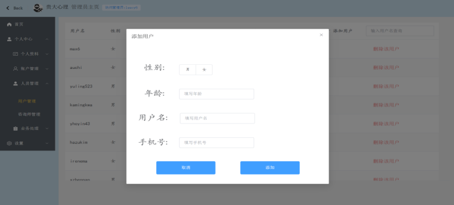

# online_psychological_counseling_platform
基于springboot、vue3、mybatis-plus、websocket、mysql编写的在线心理咨询平台

产品的功能划分主要是根据用户身份进行划分，主要如下：

1.普通用户

(1)注册功能：注册账号用以登录进入系统。

(2)登录功能：使用自己所注册的账号密码进行登录。

(3)查看咨询师：可以查看咨询师信息，可以对咨询师进行预约和咨询师入驻申请。

(4)个人资料管理：用户可以查看个人资料，可以进行修改。

(5)预约记录：可查看自己的预约记录，可以进行修改、删除、查询、重新预约等
操作。

(6)我的私信：可查看自己发出的私信，可以进行查询、删除操作。

(7)我的评价：可查看自己所发布过的评价信息，可以进行查询、删除操作。

(8)资质查看：可以对自己的咨询师入驻申请情况进行查看，失败可以重新进行申
请。

(9)账户管理：用户可以对用户名或密码进行修改，可以进行账号注销操作。

(10)在线咨询：用户可在预约记录中对预约成功的记录进行联系咨询师操作，
可以与咨询师进行在线沟通。

2．咨询师

咨询师具有普通用户的所有功能，差别是咨询师所查看到的预约、私信、评价，都是用户对自己发出的，不是本人发出的。除此之外还具有以下功能：

(1)预约审核：咨询师可以查看用户对自己的预约，可根据用户名模糊查询并根据
个人安排进行同意或拒绝操作。

(2)私信回复：咨询师可根据用户名模糊查询，可以对用户发来的私信消息进行回
复。

(3)在线咨询：咨询师可以对预约成功的用户发起在线聊天，给用户进行咨询工作，
咨询结束后咨询师可以将本次预约更新为完成操作。

3.管理员

管理员除登录功能外其他功能均只在个人中心展示，相关功能如下：

(1)登录功能：管理员可以输入对应账号密码进行登录，无需注册，管理员由开发
者本人自定义。

(2)评价审核：用户的评价首先需要经过管理员审核，管理员可以进行模糊查询，
审核通过后的评价才能展示到咨询师详情页，咨询师在个人中心才可查看到相关评价。

(3)资质审核：管理员可以查看用户发来的咨询师入驻申请，对其相关信息进行审
核，管理员可以进行模糊查询，审核通过后用户可成为咨询师。

(4)账户管理：管理员可以对用户名或密码进行修改，可以进行账号注销操作。

(5)用户管理：管理员可以查看本平台的用户信息，管理员可以进行模糊查询，
可以进行添加、查找、删除操作。

(6)咨询师管理：管理员可以查看本平台 咨询师信息管理员可以进行模糊查询，
可以进行添加、查找、删除操作。

(7)个人资料管理：管理员可查看自身相关信息，可以进行修改。

(8)公告管理：管理员可发布、删除公告。

页面展示：

登录页：

注册页：

咨询师查询：

咨询师入驻申请：

!

咨询师详情页：

!

私信：

!

预约：

管理员中心：

添加用户：

删除用户：

私信审核：

在线咨询：

